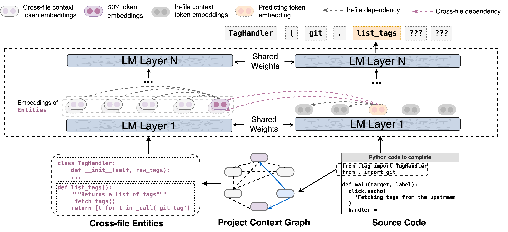

# CoCoMIC: Code Completion By Jointly Modeling In-file and Cross-file Context

This repository conatins the code for the paper [CoCoMIC: Code Completion By Jointly Modeling In-file and Cross-file Context](https://arxiv.org/abs/2212.10007) at LREC-COLING 2024. 

You may also want to check out our other paper on [CrossCodeEval](https://crosscodeeval.github.io/) at NeurIPS 2023.


## Quick Links

- [Overview](#overview)
- [Getting Started](#getting-started)
- [Use CCFinder](#use-ccfinder)


## Overvew

We propose CoCoMIC, a framework that incorporates cross-file context to learn the in-file and cross-file context jointly on top of pretrained code LMs. 

### CCFinder: Cross-file Context Finder

CCFinder parses the project hierarchy and code components to extract project information. CCFinder further builds a project context graph to represent the details of each component and the interactions among them. When an incomplete program requests completion, the tool will retrieve the neighbors of the pinpointed entities from the graph as the cross-file context of the current file. 

<p align="center">
  
</p>

### CoCoMIC: Model Architecture

We propose a novel model architecture built on top of existing code LMs with joint attention to in-file and retrieved cross-file context. First, the model will compress cross-file context and build its representations. 
Second, when generating code completion, the model will attend to both the compressed cross-file context and the concrete in-file context. 

<p align="center">
  
</p>


## Getting Started

### Set up envionment

```
conda create -n cocomic python=3.9.13
conda activate cocomic
pip install torch==1.12.1+cu113 --extra-index-url https://download.pytorch.org/whl/cu113
pip install -r requirements.txt
```

### Download and build tree-sitter library

```
mkdir ts_package;
cd ts_package;
# Download the tree-sitter package
git clone https://github.com/tree-sitter/tree-sitter-python.git;
# checkout to 0.20.0 version
git checkout v0.21.0;
cd ..;
# Build tree-sitter
python build_ts_lib.py
``` 

If the the commands finishes successfully, you should be able to see a `ccfinder/cc_extractor/build/`directory now under the package root, which contains a `.so` file

## Use CCFinder

__Input__

The input is a folder containing the source code of a Python project.

__Command__

```
export PYTHONPATH=$(pwd)/ccfinder;
python ccfinder/build_crossfile_context.py --input_project <PATH_TO_PROJECT_FOLDER> --output_dir <OUTPUT_FOLDER>
```

__Output__

```shell
|---<OUTPUT_FOLDER>
   |---<PROJECT_NAME>_project_context.json # Hierarchical Project Context
   |---<PROJECT_NAME>_project_context.node # List of Project Entities
   |---<PROJECT_NAME>_project_context.edge.jsonl # List of Entity Relations 
   |---<PROJECT_NAME>_project_context.graph # Intermediate Graph Structure
   |---<PROJECT_NAME>_project_context.graph.adj.pk # Intermediate Graph Structure in the format of Adjacency Matrix
   |---<PROJECT_NAME>_retrieved_nodes.json # Retrieved Project Entities for each file in the project
```

### Create Samples with Cross-file Context

__Input__

When you have a list of prompts for a specific project to complete, please format them with the following attribute and save them in a `<PROJECT_NAME>_prompts.jsonl` file, where each line corresponds to one sample

```json
{"prompt":"...<IN-FILE CONTEXT>...","groundtruth":"...","metadata":{"file":"<ABSOLUTE_FILE_PATH>"}}
```

__Command__

```
python ccfinder/create_sample_w_cfc.py \
    --retrieved_entity_file <PATH_TO>/<PROJECT_NAME>_retrieved_nodes.json \
    --prompt_file <PATH_TO>/<PROJECT_NAME>_prompts.jsonl \
    --output_file <PATH_TO>/<PROJECT_NAME>_prompts_with_cfc.jsonl
```
__Output__

The output will be a `.jsonl` file, and each line corresponds to a sample with its cross-file context in the following format

```json
{
    "prompt": " ... ",
    "groundtruth": " ... ",
    "retrieved_nodes": [
        " ...<PROJECT_ENTITY>... ",
    ],
    "retrieved_edges": [
        ["<ENTITY_IDX>", "<RELATION_TYPE>", "<RELATION__TYPE_IDX>", "<ENTITY_IDX>"],
    ],
    "metadata": {
        "file":"<ABSOLUTE_FILE_PATH>"
    }
}
```
